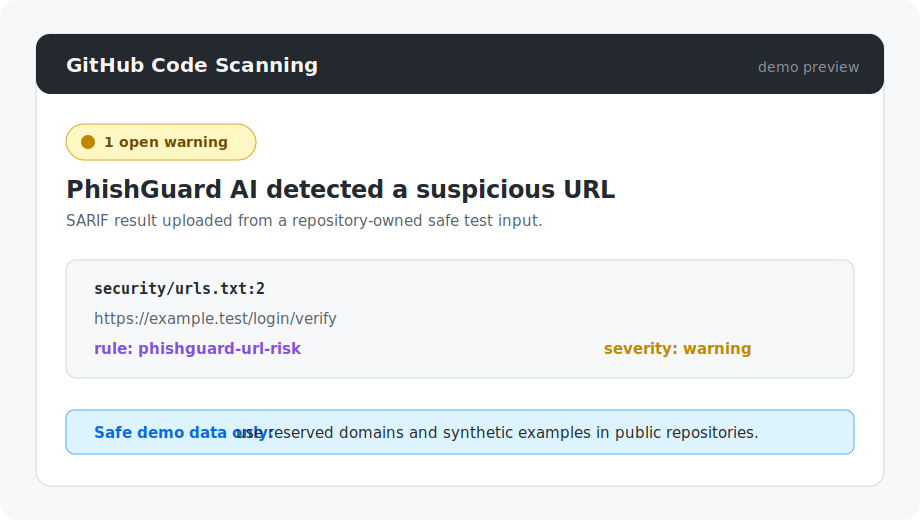

# GitHub Code Scanning Integration

PhishGuard can export SARIF 2.1.0 so suspicious and phishing results appear in
security tools that accept the standard format.

## Generate SARIF

Create a text file containing one URL per line, then run:

```bash
python phishguard.py batch security/urls.txt \
  --format sarif \
  --output phishguard.sarif
```

`SAFE` results are omitted from SARIF. `SUSPICIOUS` results use warning
severity, and `PHISHING` results use error severity. Each finding includes its
probability, feature breakdown, target type, and a stable fingerprint.

Do not scan or commit URLs containing live credentials, private tokens, or
personal data. SARIF reports include the analyzed URL or email subject as a
logical location.

## GitHub Actions

A copy-ready workflow is available at
[`.github/examples/phishguard-code-scanning.yml`](../.github/examples/phishguard-code-scanning.yml).
It checks out PhishGuard separately, scans a repository-owned URL list, and
uploads the report with GitHub's official SARIF action.

The target repository must contain `security/urls.txt`, or the workflow path
must be changed to the appropriate input file.

GitHub Code Scanning accepts third-party SARIF uploads for public
repositories. Private and internal repositories require GitHub Code Security
to be enabled.

## Code Scanning Preview

After the workflow uploads `phishguard.sarif`, GitHub displays PhishGuard
findings on the repository's **Security > Code scanning** page. The alert links
back to the input file and includes the PhishGuard rule ID, severity, and
finding message.



The preview uses reserved documentation input such as
`https://example.test/login/verify`. It is a safe visual example only; do not
add live phishing sites, real credentials, private tokens, or personal data to
public SARIF examples.

## Native JSON

JSON remains the default output format:

```bash
python phishguard.py batch security/urls.txt --output results.json
```

Existing scripts do not need to change unless they opt into
`--format sarif`.
