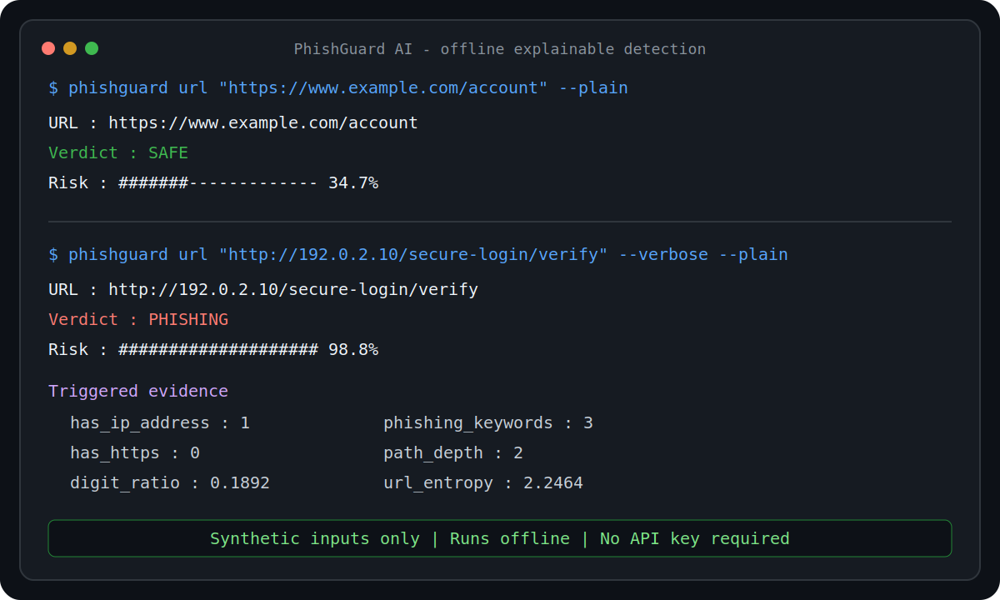

# Project Evidence

This page records reproducible technical and community evidence for
PhishGuard AI. Counts are a dated snapshot, not claims of production adoption.

## Technical Evidence

Snapshot verified on June 9, 2026:

- URL regression fixture: 14 public-safe samples
- Confusion matrix: 7 true positives, 7 true negatives, 0 false positives,
  and 0 false negatives
- Fixture precision: 1.000
- Fixture recall: 1.000
- Fixture false-positive rate: 0.000
- Supported Python versions in CI: 3.10, 3.11, 3.12, and 3.13
- Security automation: CodeQL, repository policy checks, and dependency audit
- Release engineering: three tagged releases, with checksums and build
  provenance on v0.4.0

Run the benchmark yourself:

```bash
python tools/evaluate_url_benchmark.py
```

These results measure the checked-in regression fixture. They are not
population-level accuracy, calibration, or production-effectiveness claims.
See [BENCHMARK.md](BENCHMARK.md) for the fixture limitations.

## Community Evidence

GitHub snapshot verified on June 9, 2026:

- 3 repository forks
- 1 merged pull request from an external human contributor
- 1 automated dependency-update pull request merged
- 7 open issues offering scoped contribution opportunities
- 3 tagged releases
- 1 recorded download of a v0.4.0 release asset

The external contribution added plain-text CLI output and is preserved in
[pull request #7](https://github.com/omobolajiadeyan/phishguard-ai/pull/7).
Repository counts change over time; use the live badges and GitHub pages for
current values.

## Demonstration



The screenshot was prepared from the real output of:

```bash
python phishguard.py url "https://www.example.com/account" --plain
python phishguard.py url \
  "http://192.0.2.10/secure-login/verify" \
  --verbose \
  --plain
```

Both inputs are public-safe. `example.com` is reserved for documentation, and
`192.0.2.0/24` is the TEST-NET-1 documentation range.

The
[18-second safe demo video](https://github.com/omobolajiadeyan/phishguard-ai/releases/download/v0.4.0/phishguard-demo.mp4)
attached to the
[v0.4.0 release](https://github.com/omobolajiadeyan/phishguard-ai/releases/tag/v0.4.0)
shows the same offline workflow. The commands remain in
[QUICK_DEMO.md](QUICK_DEMO.md) so reviewers can reproduce the result rather
than relying on a recording.

## Evidence Boundaries

PhishGuard is an early-stage open-source project. Stars, traffic, deployments,
and organizational adoption are not claimed unless they can be independently
verified. Future evidence should include dated sources, commands, and
limitations.
