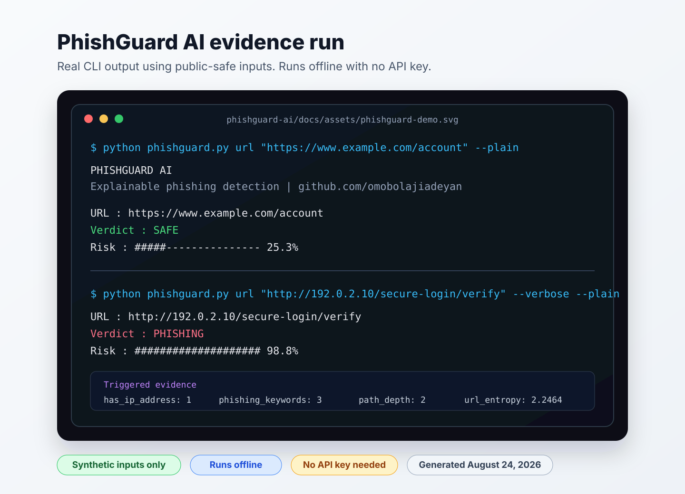

# Project Evidence

This page records reproducible technical and community evidence for
PhishGuard AI. Counts are a dated snapshot, not claims of production adoption.

## Technical Evidence

Snapshot re-verified on August 24, 2026 (previous snapshot: July 28, 2026),
against `main` at commit `3baaacb` (#97, "add opt-in RDAP domain-age
detection, fix free-hosting/packaging gaps"):

- URL regression fixture: 14 public-safe samples
- Confusion matrix: 7 true positives, 7 true negatives, 0 false positives,
  and 0 false negatives
- Fixture precision: 1.000
- Fixture recall: 1.000
- Fixture false-positive rate: 0.000
- Full test suite: 192/192 passing (2 skipped), run locally via
  `python -m unittest discover -s tests`
- Supported Python versions in CI: 3.10, 3.11, 3.12, and 3.13
- Security automation: CodeQL, repository policy checks, and dependency audit
- Release engineering: five tagged releases, with installable artifacts,
  checksums, and build provenance on recent releases; wheel contents
  independently rebuilt and inspected on 2026-08-24 to confirm the new
  `domain_age.py` module is packaged (`python -m build --wheel`)
- Integration surfaces: CLI, stable Python API, GitHub Marketplace Action,
  SARIF 2.1.0 output, browser demo, browser extension prototype, and stdlib
  REST API server mode (`/healthz`, `POST /v1/url`, `POST /v1/email` — all
  smoke-tested live on 2026-08-24, including 400 rejection of a malformed
  request body)
- Trust-boundary coverage: saved-email authentication parsing, SARIF
  validation, parser regression tests, public-safe demonstration inputs, and
  an opt-in RDAP domain-age lookup (`--check-domain-age`) that is the one
  place the offline scanner makes a network call — always to the fixed,
  trusted `rdap.org` bootstrap, never to the domain being scored

Run the benchmark yourself:

```bash
python tools/evaluate_url_benchmark.py
```

These results measure the checked-in regression fixture. They are not
population-level accuracy, calibration, or production-effectiveness claims.
See [BENCHMARK.md](BENCHMARK.md) for the fixture limitations.

## Live-Traffic Validation Evidence

Re-verified on August 24, 2026 by independently re-running the model against
a fresh OpenPhish feed and confirming the numbers reported in #97:

| Metric | Offline only | + opt-in domain age |
| --- | --- | --- |
| Recall (flag = PHISHING or SUSPICIOUS) | 55.0% (165/300) | **65.7%** (197/300) |
| Recall (strict PHISHING only) | 29.7% (89/300) | **32.7%** (98/300) |
| False positives on real legitimate sites | 0/1,000 | **0/300** |

This is a real-traffic sample against a rotating public feed, not a static
fixture — see [BENCHMARK.md](BENCHMARK.md)'s "Domain-Age Validation" and
"Live-Traffic Validation" sections for full methodology, sample-size caveats,
and the named categories of phishing this still misses (bare-root URLs and
old-but-compromised domains, both page-content problems no URL-only or
registration-date feature can reach).

The domain-age feature was independently smoke-tested end to end for this
snapshot: CLI lookup against a real, long-registered domain correctly
returned "registered 90+ days ago," and the same check surfaced
`domain_newer_than_30d`/`domain_newer_than_90d` in the REST server's
`POST /v1/url` response when `check_domain_age` was set. (Reviewer note: a
Homebrew-Python local CA bundle gap — unrelated to this project's code —
caused an initial `CERTIFICATE_VERIFY_FAILED`; setting `SSL_CERT_FILE` to
`certifi`'s bundle resolved it. Anyone hitting the same error locally is
looking at a Python install issue, not a PhishGuard bug.)

## Product Readiness Evidence

Recent reviewer-facing improvements:

| Area | Evidence |
| --- | --- |
| Benchmark transparency | [BENCHMARK.md](BENCHMARK.md) records the public-safe baseline, recall improvement, and limits. |
| Detection model | [DETECTION_MODEL.md](DETECTION_MODEL.md)'s "Domain Age (RDAP)" section documents the opt-in `--check-domain-age` feature, its weights, and its explicit blind spots. |
| Python embedding | [PYTHON_API.md](PYTHON_API.md) documents direct `score_url` and `score_email` usage without shelling out. |
| CI and code scanning | [GITHUB_CODE_SCANNING.md](GITHUB_CODE_SCANNING.md) provides SARIF generation and upload guidance. |
| Browser use | [BROWSER_EXTENSION.md](BROWSER_EXTENSION.md) documents the unpacked Chrome/Edge extension for current-tab and pasted-URL checks. |
| REST integration | The README documents `phishguard serve` with local default binding and endpoint examples. |
| Safe adoption | [ADOPTION.md](ADOPTION.md) and [FIRST_CONTRIBUTION.md](FIRST_CONTRIBUTION.md) give external users low-friction paths to try, report, and contribute. |
| Evaluator experience | [EVALUATOR_GUIDE.md](EVALUATOR_GUIDE.md) gives a five-minute path to run safe examples and inspect trust boundaries. |

## Community Evidence

GitHub snapshot verified on June 9, 2026 and retained as a historical
baseline:

- 3 repository forks
- 1 merged pull request from an external human contributor
- 1 automated dependency-update pull request merged
- 7 open issues offering scoped contribution opportunities
- 3 tagged releases
- 1 recorded download of a v0.4.0 release asset

The external contribution added plain-text CLI output and is preserved in
[pull request #7](https://github.com/omobolajiadeyan/phishguard-ai/pull/7).
Repository counts change over time; use the live badges and GitHub pages for
current values.

## Demonstration



The screenshot was prepared from the real output of:

```bash
python phishguard.py url "https://www.example.com/account" --plain
python phishguard.py url \
  "http://192.0.2.10/secure-login/verify" \
  --verbose \
  --plain
```

Both inputs are public-safe. `example.com` is reserved for documentation, and
`192.0.2.0/24` is the TEST-NET-1 documentation range.

The
[18-second safe demo video](https://github.com/omobolajiadeyan/phishguard-ai/releases/download/v0.4.0/phishguard-demo.mp4)
attached to the
[v0.4.0 release](https://github.com/omobolajiadeyan/phishguard-ai/releases/tag/v0.4.0)
shows the same offline workflow. The commands remain in
[QUICK_DEMO.md](QUICK_DEMO.md) so reviewers can reproduce the result rather
than relying on a recording.

## Evidence Boundaries

PhishGuard is an early-stage open-source project. Stars, traffic, deployments,
and organizational adoption are not claimed unless they can be independently
verified. Future evidence should include dated sources, commands, and
limitations.
